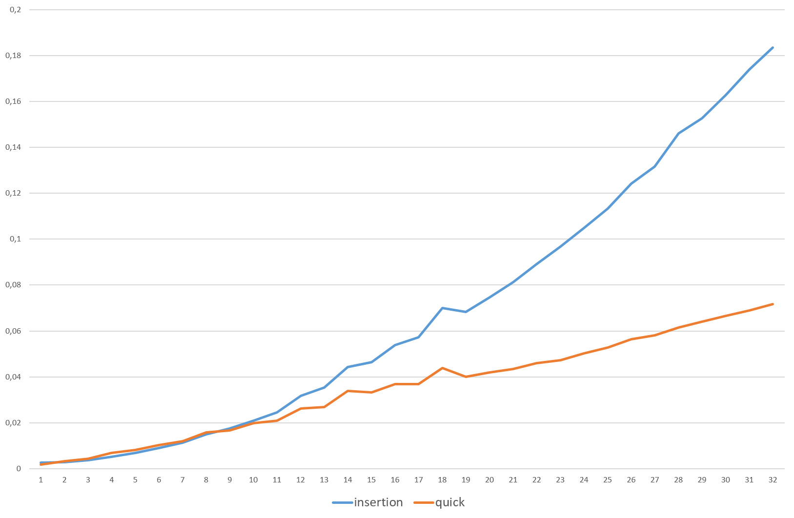

# #3: QuickSort
Обобщенная функция `hybrid_sort()` реализует алгоритм быстрой сортировки со следующими
оптимизациями:

1. Выбор опорного элемента `median()`, как медианы из первого, среднего и последнего элемента сортируемого интервала;

2. Исключение хвостовой рекурсии;

3. Move-семантика для обмена элементов в процессе разбиения (функция `swap()`) и при сортировке вставками.

4. Использование алгоритма сортировки вставками `insertion_sort()` для коротких интервалов.

	Значение `INSERTION_SORT_USING_POINT = 8` подобрано экспериментально:

	
