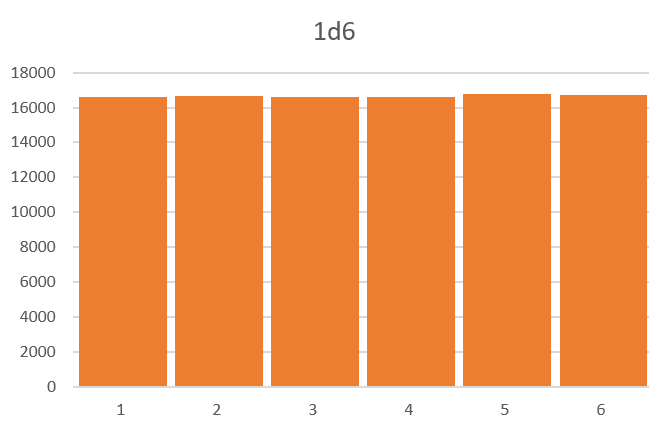

# #4: Dice
Функция `int dice( DiceParams params )` возвращает результат броска указанного количества костей заданного типа с модификаторами (прибавления или умножения на число).

Класс `DiceParams` можно получить из строки типа `"10 * 2d6 + 5"`, запись 2d6 означает две шестигранных кости.

### Графики распределений

* **1d6**
	Равномерное распределение.
	

* **2d6**
	Нормальное распределение.
	

* **3d6**
	Нормальное распределение.
	

* **1d10**
	Равномерное распределение.
	

* **2d10**
	Нормальное распределение.
	

* **3d10**
	Нормальное распределение.
	